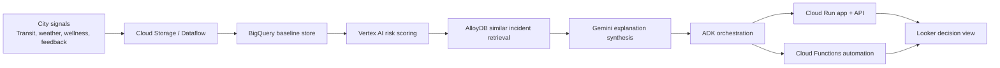
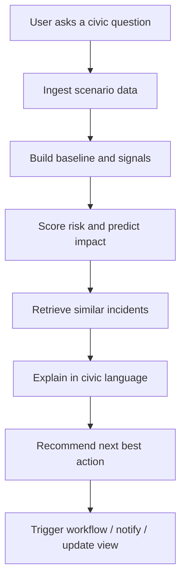
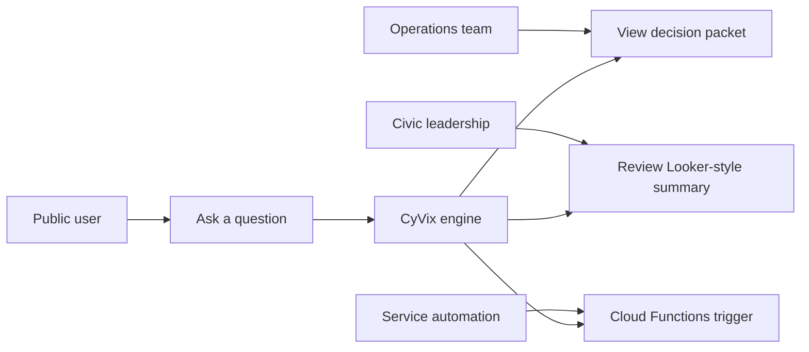
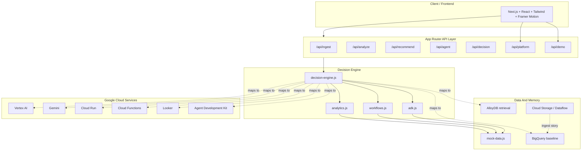

# CyVix

CyVix is a civic decision intelligence platform for the Google Cloud hackathon brief. It turns fragmented city signals into an explainable decision packet that helps public teams detect issues early, understand why they matter, and trigger the next action.

Live demo:

- [Cloud Run deployment](https://cyvix-895728166282.asia-south1.run.app)

## Live Stack Status

The demo is explicit about what is live today versus what is represented as product architecture.

| Service | Current Status | Notes |
| --- | --- | --- |
| Cloud Run | Live | Hosts the deployed app and API routes |
| BigQuery | Live | Used for scenario baseline reads when configured |
| Cloud Storage | Live | Writes ingest batches when configured |
| Looker | Demo layer only | Shown as a leadership dashboard concept, not embedded live yet |
| Managed Service for Apache Spark | Not used | Not part of the current prototype |
| Google Kubernetes Engine | Not used | Not part of the current prototype |
| Gemini Enterprise Agent Platform | Not used | The agent layer is modeled in-app, not wired to this platform yet |

The broader Google Cloud narrative in the UI and README also maps to:

- `Vertex AI` for prediction and scoring language
- `Gemini` for explanation synthesis language
- `AlloyDB` for retrieval and incident memory language
- `Cloud Functions` for workflow automation language
- `Agent Development Kit (ADK)` for orchestration language

Those layers are represented by the decision engine, agent trace, and UI copy today, while BigQuery, Cloud Storage, and Cloud Run are the live cloud-backed pieces.

## 1. How We Approached The Problem Statement

We translated the broad problem statement into a focused product: a civic operations layer that can ingest structured and unstructured data, score risk, retrieve similar incidents, explain outcomes in natural language, and trigger follow-up workflows.

The solution maps directly to the Google Cloud ecosystem:

- `BigQuery` stores the city baseline and scenario history. The app now queries it when dataset and table env vars are configured.
- `Vertex AI` performs risk scoring and prediction in the product narrative.
- `Gemini` turns outputs into plain-language explanations in the product narrative.
- `AlloyDB` stores and retrieves similar incidents and playbooks in the product narrative.
- `Cloud Run` serves the app shell and decision APIs live.
- `Cloud Functions` handles automated follow-up actions in the product narrative.
- `Agent Development Kit (ADK)` orchestrates the observe -> reason -> retrieve -> explain -> act loop in the product narrative.
- `Looker` represents the leadership and operations dashboard layer in the product narrative.
- `Cloud Storage` and `Dataflow` are used in the data-ingest story. The app now writes ingest batches to a bucket when configured.

The current build is fully demoable with local mock data and deterministic decision logic. It does not require live Google keys to run locally, but the code and documentation are structured so those services can be swapped in cleanly.

Live cloud-backed behavior now works for:

- BigQuery reads for scenario baseline context
- Cloud Storage writes for ingest batches
- Cloud Run deployment for the live demo URL

Those features fall back to local demo mode if the cloud env vars are missing.

If you add provider keys in `.env.local`, the app will enrich the civic summaries with live LLM output:

- `GROQ_API_KEY`
- `GROQ_MODEL`
- `NVIDIA_NIM_API_KEY`
- `NVIDIA_NIM_BASE_URL`
- `NVIDIA_NIM_MODEL`
- `GOOGLE_CLOUD_PROJECT`
- `GCP_PROJECT_ID`
- `BIGQUERY_DATASET`
- `BIGQUERY_TABLE`
- `BIGQUERY_LOCATION`
- `GCS_BUCKET`

## 2. Real-World Problem And Practical Impact

Modern communities generate data from transit, utilities, weather, wellness signals, citizen feedback, and service logs. The hard part is not collecting data. The hard part is turning it into a decision that a city team can trust quickly.

CyVix helps with:

- Faster detection of service failures and neighborhood risk.
- Better prioritization for city operations teams.
- Clearer resident communication through explainable summaries.
- Better response coordination across departments.
- A single view for individual, organizational, and civic decision-making.

Example use cases:

- Transit delay escalation
- Water pressure drift
- Heat resilience and wellness risk
- Citizen service triage
- Emergency preparedness and recovery

## 3. Core Architecture And Workflow

CyVix follows a decision-intelligence pipeline rather than a static dashboard:

1. Ingest multi-source city data.
2. Normalize and baseline the signals.
3. Score anomaly and likely impact.
4. Retrieve similar incidents and playbooks.
5. Generate a civic explanation.
6. Propose the next best action.
7. Trigger automation and publish the decision trace.



### Decision Engine In The Repo

The current repo uses a local, deterministic decision engine so the demo works without external credentials:

- `lib/analytics.js` scores the scenario and builds the explanation.
- `lib/workflows.js` converts analysis into a recommendation packet.
- `lib/adk.js` builds the agent lifecycle trace.
- `lib/decision-engine.js` fuses the above into one decision object.
- `app/api/*` exposes the ingest, analyze, recommend, agent, and decision routes.

This gives the app a real backend shape now, while keeping it ready for a live Google Cloud swap later.

## 4. Opportunity And USP

CyVix is different from a generic civic dashboard because it does not stop at visualization.

USP:

- It produces a decision packet, not just charts.
- It shows the evidence trail, confidence, and counterfactual.
- It combines structured data, text signals, and historical memory.
- It makes the ADK lifecycle visible.
- It can be extended into live Google Cloud workflows without redesigning the product.

Why it stands out:

- Most hackathon apps show data.
- CyVix shows what to do next and why.
- Most apps are one-page demos.
- CyVix is structured like a real SaaS with navigation, product sections, and operational views.

## 5. Features

- Multi-scenario civic risk demo
- Natural-language query box
- Rolling agent trace and tool-call view
- Google Cloud service mapping
- Looker-style embed shell with filters and drill-down tabs
- Signal fabric and baseline scoring
- Similar incident retrieval
- Civic explanation generation
- Recommendation and automation packet
- Counterfactual preview if the city delays action
- Sidebar navigation and multi-section SaaS layout
- Accessible buttons, semantic sections, and keyboard-friendly anchors

## 6. Process Flow Diagram



### Use-Case View



## 7. Architecture Diagram



## 8. Technologies / Google / NVIDIA Services Used

### Frontend And App Stack

- Next.js 16 App Router
- React 19
- Tailwind CSS v4
- Framer Motion
- Lucide React

### Google Cloud Services Represented In The Solution

| Service | Role In CyVix | Status |
| --- | --- | --- |
| Cloud Storage | Raw city feed landing zone | Live ingest writes when `GCS_BUCKET` is configured |
| Dataflow | Stream normalization and joins | Modeled in the ingest story |
| BigQuery | Historical baseline and feature layer | Live reads when dataset and table env vars are configured |
| Vertex AI | Risk scoring and prediction | Represented in analysis and decision packets |
| Gemini | Natural-language explanation layer | Represented in the agent story |
| AlloyDB | Similar-incident retrieval and memory | Represented in retrieval flow |
| Cloud Run | API hosting and app shell | Live deployment URL is published above |
| Cloud Functions | Workflow automation and alerts | Represented in recommendation flow |
| Looker | Leadership dashboard and drill-down | Represented in product/storyboard layer |
| Agent Development Kit (ADK) | Multi-step orchestration | Visible in the agent trace |
| Managed Service for Apache Spark | Batch processing layer | Not used in the current prototype |
| Google Kubernetes Engine | Container orchestration layer | Not used in the current prototype |
| Gemini Enterprise Agent Platform | Managed agent platform | Not used in the current prototype |

### NVIDIA Services

The current submission does not depend on NVIDIA services. The architecture is centered on the Google Cloud stack requested in the brief. If needed later, GPU-accelerated inference or NVIDIA tooling can be added as an optional runtime layer, but it is not part of the current demo.

## 9. Code Quality, Security, Efficiency, And Accessibility Checks

### Code Quality

- Semantic sections and structured components
- Clear separation between UI, API, analytics, workflows, and agent orchestration
- Reusable mock-data and decision-engine layers
- Build verification completed successfully

### Security

- No secrets committed to the repo
- Demo runs locally without API keys
- External integrations are isolated behind API routes
- Sensitive production credentials are intended to live in environment variables

### Efficiency

- Deterministic local scoring for fast demo response
- Small API payloads and reusable scenario data
- SVG-based charts instead of heavyweight chart libraries
- Client-side motion without unnecessary state churn

### Accessibility

- Semantic HTML sections and landmarks
- Keyboard-friendly navigation anchors
- High-contrast text and visible interactive states
- `cursor-none` is paired with a custom cursor, not a hidden pointer
- Content remains readable and responsive on smaller screens

## Environment Keys For Production Integration

The current demo works without keys. For live Google Cloud integration, wire the following through environment variables or secret managers:

- `GROQ_API_KEY`
- `GROQ_MODEL`
- `NVIDIA_NIM_API_KEY`
- `NVIDIA_NIM_BASE_URL`
- `NVIDIA_NIM_MODEL`
- `GOOGLE_APPLICATION_CREDENTIALS`
- `GCP_PROJECT_ID`
- `GCP_REGION`
- `GOOGLE_CLOUD_PROJECT`
- `BIGQUERY_DATASET`
- `BIGQUERY_TABLE`
- `BIGQUERY_LOCATION`
- `GCS_BUCKET`
- `VERTEX_LOCATION`
- `ALLOYDB_CONNECTION_URL`
- `GEMINI_API_KEY` or service-account based Gemini access
- `LOOKER_DASHBOARD_TITLE`
- `LOOKER_DASHBOARD_URL`
- `LOOKER_EMBED_URL`
- `LOOKER_INSTANCE_URL`
- `LOOKER_CLIENT_ID`
- `LOOKER_CLIENT_SECRET`
- `GKE_CLUSTER_NAME`
- `GKE_LOCATION`
- `GKE_NAMESPACE`
- `GKE_IMAGE`

### What Is Actually Live Today

- `BigQuery`: yes, used by the live app for scenario baseline reads when the dataset and table env vars are set.
- `Cloud Storage`: yes, used by the live app for ingest batch writes when `GCS_BUCKET` is set.
- `Cloud Run`: yes, the demo is deployed and reachable at the live URL above.
- `Looker`: no, currently a product-story layer only.
- `Managed Service for Apache Spark`: no, not integrated.
- `Google Kubernetes Engine`: no, not integrated.
- `Gemini Enterprise Agent Platform`: no, not integrated.
- `Vertex AI`, `Gemini`, `AlloyDB`, `Cloud Functions`, `ADK`: represented in the architecture, trace, and copy, but not yet wired to live Google APIs in this prototype.

## Local Run

1. Install dependencies:

```bash
npm install
```

2. Start the app:

```bash
npm run dev
```

3. Open:

```text
http://localhost:3000
```

### Google Cloud Setup For Live Data

If you want the real BigQuery and Cloud Storage paths to run locally, authenticate the Google Cloud CLI first:

```text
gcloud auth application-default login
gcloud config set project gcp-apac-501407
```

Expected BigQuery table shape for baseline reads:

- `scenario_id`
- `risk_score`
- `confidence`
- `summary`
- `updated_at`

Expected Cloud Storage bucket behavior:

- The ingest route writes JSON batches to `gs://$GCS_BUCKET/cyvix/ingest/...`

### BigQuery Seed Script

Use this when you want the scenario baseline table populated immediately:

```bash
npm run seed:bigquery
```

What it does:

- Seeds the `cyvix_demo.scenario_baselines` table from the local scenario catalog.
- Creates the dataset and table if they do not already exist.
- Inserts flattened scenario rows with risk, confidence, summaries, and trace fields.

Expected environment:

- `GCP_PROJECT_ID` or `GOOGLE_CLOUD_PROJECT`
- `BIGQUERY_DATASET`
- `BIGQUERY_TABLE`
- `BIGQUERY_LOCATION` or `GCP_REGION`

### Demo Initializer

Use this when you want the full demo bundle initialized in one pass:

```bash
npm run demo:init
```

What it does:

- Seeds BigQuery with the scenario baseline rows.
- Writes a demo manifest and seed bundle to Cloud Storage when `GCS_BUCKET` is configured.
- Mirrors the status information that the in-app demo panel shows through `/api/demo`.

### GKE Deployment Path

The app is also container-ready for GKE:

- `Dockerfile` builds the Next.js app into a production container.
- `k8s/gke/cyvix.yaml` contains the namespace, deployment, and service.

Suggested path:

```bash
gcloud builds submit --tag gcr.io/$PROJECT_ID/cyvix:latest .
kubectl apply -f k8s/gke/cyvix.yaml
kubectl -n cyvix rollout status deployment/cyvix
```

## Demo Notes

- Switch between scenarios to show different city conditions.
- Ask a natural-language question to trigger the decision engine.
- Use the sidebar to jump between product sections.
- Show the agent trace, tool calls, and counterfactual to explain how the system works.
- Use the Looker-style panel to show operational status, faux filters, and drill-down tabs.
- Point to the Google Cloud mapping to demonstrate that the solution is grounded in real platform primitives.
